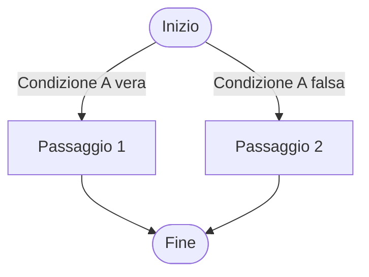

Genera un diagramma Mermaid in formato testo di questa nota: {activeNote}. Voglio rappresentare [tipo di diagramma, es. flowchart, diagramma di Gantt, diagramma di sequenza]. Il diagramma deve includere i seguenti elementi:

- [Elemento 1] collegato a [Elemento 2] con una freccia direzionale
- [Elemento 3] collegato a [Elemento 4] con una relazione bidirezionale
- [Altri dettagli, es. condizioni, stati, etichette sui collegamenti]

Usa una sintassi chiara e commenti per ogni sezione, e assicurati che il diagramma sia compatibile con il formato di Obsidian.

---

**Esempio per un flowchart:**  
"Genera un diagramma Mermaid che rappresenti un processo decisionale semplice:

- Inizio
- Se la condizione A è vera, vai a Passaggio 1
- Se la condizione A è falsa, vai a Passaggio 2
- Entrambi i passaggi portano a Fine  
    Mostra le condizioni come etichette sulle frecce."

Il risultato dovrebbe essere qualcosa del genere:

````markdown

````

